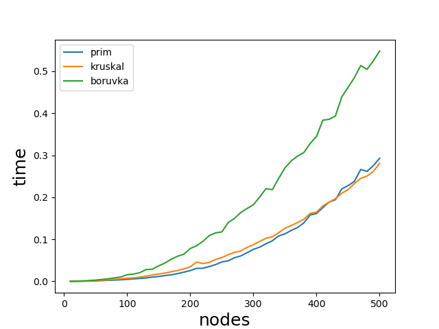

# 情報数理特論第一回課題
最小全域木問題を授業で扱ったprim法，kruskal法，boruvka法で解き，それぞれの実行時間を比較した． 
ソースコードは[github](https://github.com/mizzn/information-mathematics1)にて参照可能．   

## 実行結果

primとkruskalはほぼ同等の実行時間となった．  
boruvkaはprim, kruskalとおよそ2倍ほどの実行時間になった．これは，隣接リストを方向を区別して与えているため，同じ処理を重複して実行しているためであると考えられる．

## シミュレーションについて
ノード数を10個から500個まで10個刻みで変化させた．
これを1シミュレーションとし，10シミュレーション実行した．  
各アルゴリズムの実行時間を計測し，シミュレーション数で平均をとったグラフを，result.pngに保存した．  

デフォルト値は，  
sims = 10 # シミュレーション数  
node_size_min = 10 # 最初のノード数
node_size_max = 500 # 最大のノード数
node_diff = 10 # ノード数の変化

## NetworkXでのテストデータの作成
random_graphs.fast_gnp_random_graphでランダムにグラフを作成した．  
パスができる確率は0.3に設定した．また，0以上1未満の実数を重複なしで生成し，重みとしてグラフに追加している．  
グラフ，重みともにn回目のシミュレーションなら，ランダムシード値はnになっている．

## 実行方法
`python main.py`で実行

## 使用ライブラリ
- numpy
- NetworkX
- matplotlib
